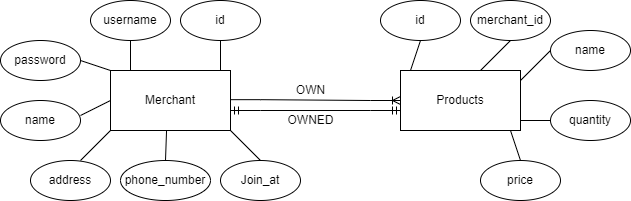

# **NOTE**

In this mini project I did more than what was asked. I used this mini project as my oppurtunity to explore and learned  more about API and back-end, that's why I would be very happy to get some advice, pointers and critics from mas Abduh for my mini project whether it works well or not on LMS comment section or even discord. 


# **MICROSERVICE ARCHITECTURE**


Above is the microservice architecture for this mini project. according to diagram, the browser will connect to web app(website) and then from there the web app will process some services that available for merchant and product. in merchant service, it will create new account(data) into data base, update, get all information and delete account from database. the same thing with product service, it will help merchanst to input product into database, also it can update, get all information about the product and delete product from the database.


# **ERD**


This ERD for the database in this project. from what we can see, the two entities have so many attributes. and I decide to use one to many relation for the entities because it's more fit for this project where merchant can have so many products but one product can only have one owner. 


# **USED MODULES**

* sequelize
* mysql2
* dotenv
* express
* jsonwebtoken
* cookie-parser


# **MERCHANT**

 ## **MERCHANT OBJECT**
```
{
  username: string,
  password: string,
  name: string,
  address: string,
  phone_number: integer
}
```

**GET /merchantList**
----
  Returns information about all merchants.
* **URL Params**
  None
* **Data Params**
  None
* **Headers**
  Content-Type: application/json  
 
* **Success Response:**
* **Code:** 200
  **Content:**  
```
{

      {<merchant_object>},
      {<merchant_object>},
      {<merchant_object>},
      {<merchant_object>},
      {<merchant_object>}

      
}
```
* **Error Response:**  
 * **Code:** 404  
  **Content:** `not found`


**POST /registration**
---
  Input all merchant/user information to make an account
* **URL Params**
  None
* **Data Params**
  ```
  {
    username: string,
    password: string,
    name: string,
    address: string,
    phone_number: integer
  }


* **Headers**
  Content-Type: application/json
* **Bearer Token**
  None
* **Success Response:**
  * **Code:** 200
  **Messege:** Register Success
* **Error Response:**  
  * **Code:** 400  
  **Content:** `{error: "Password can't be empty"}`  
   * **Code:** 400  
  **Content:** `{error: "Username already used"}`  
  * **Code:** 404  
  **Content:** `{ error : "User doesn't exist" }`
     * **Code:** 400  
  **Content:** `bad request`  


**POST /login**
----
  Returns the specified token for accessing merchant account.
* **URL Params**  
    NONE
* **Data Params**  
  ```
  {
    username: string,
    password: string
  }

* **Headers**  
  Content-Type: application/json  
  
* **Success Response:** 
* **Code:** 200  
  **Content:**  `<OAuth Token>`
* **Error Response:**  
  * **Code:** 400  
  **Content:** `{ error : "Wrong password" }`  
  OR  
  * **Code:** 404  
  **Content:** `{ error : "User doesn't exist" }`


**GET /token**
----
  Refresh the specified token that has been expired for accessing merchant account withouth login.
* **URL Params**  
    NONE
* **Data Params**  
    NONE
* **Headers**  
  Content-Type: application/json  
* **Success Response:** 
* **Code:** 200  
  **Content:**  `<OAuth Token>`
* **Error Response:**  
 * **Code:** 204  
  **Content:** `no content`  
  OR  
 * **Code:** 403  
  **Content:** `forbidden`


**GET /merchant**
----
  Returns all information about specified merchant in the system except password.
* **URL Params**
  None
* **Data Params**
  None
* **Headers**
  Content-Type: application/json  
  Authorization: Bearer `<OAuth Token>`
* **Success Response:**
 * **Code:** 200
  **Content:**  `{ <merchant_object> }` 
* **Error Response:** 
 * **Code:** 404  
  **Content:** `not found`
 * **Code:** 401  
* **Error Response From Auth**   
 * **Code:** 401  
  **Content:** `unauthorize`
 * **Code:** 403  
  **Content:** `forbidden`


**PUT /merchant/:username**
----
  Update some information of specified merchant.
* **URL Params**  
  *Required:* `username=[string]`
* **Data Params**  
  {

      name: string,
      address: string,
      phone_number: integer

      
  }
* **Headers**  
  Content-Type: application/json  
  Authorization: Bearer `<OAuth Token>`
* **Success Response:** 
* **Code:** 200  
  **Content:**  `Updated` 
* **Error Response:**  
 * **Code:** 400
  **Content:** `bad request`  
 * **Code:** 404  
  **Content:** `not found`
 * **Code:** 401  
* **Error Response From Auth**   
 * **Code:** 401  
  **Content:** `unauthorize`
 * **Code:** 403  
  **Content:** `forbidden`


  

**GET /merchant/password**
----
  Change the password of specified merchant.
* **URL Params**  
  NONE
* **Data Params**  
    {

      oldPassword: stirng,
      newPassword: string
      
  }
* **Headers**  
  Content-Type: application/json  
  Authorization: Bearer `<OAuth Token>`
* **Success Response:**  
* **Code:** 200  
  **Content:**  `Your password has been changed`

* **Error Response:**  
  * **Code:** 400  
  **Content:** `{ error : "Password can't be empty" }`  
  OR  
  * **Code:** 400  
  **Content:** `{ error : "Wrong old password" }`
  * **Code:** 400
  * **Code:** 401  
* **Error Response From Auth**   
 * **Code:** 401  
  **Content:** `unauthorize`
 * **Code:** 403  
  **Content:** `forbidden`


**DELETE /merchant/:username**
----
  Deletes all information and products in the database from specified merchant.
* **URL Params**  
  *Required:* `username=[string]`
* **Data Params**  
  None
* **Headers**  
  Content-Type: application/json  
  Authorization: Bearer `<OAuth Token>`
* **Success Response:** 
  * **Code:** 200 
    **Content:** `Account deleted`
* **Error Response:**  
 * **Code:** 400
  **Content:** `bad request`   
 * **Code:** 404  
  **Content:** `not found`
* **Error Response From Auth**   
 * **Code:** 401  
  **Content:** `unauthorize`
 * **Code:** 403  
  **Content:** `forbidden`


  **DELETE /logout**
----
  Logout and remove token from database.
* **URL Params**  
  None
* **Headers**  
  Content-Type: application/json  
* **Data Params**
  None  
* **Success Response:**  
* **Code:** 200  
  **Content:**  `logged out`
* **Error Response:** 
 * **Code:** 204  
  **Content:** `no content` 
 * **Code:** 400
  **Content:** `bad request`  


# **PRODUCTS**

## **PRODUCTS OBJECT**
```
{
  id: integer,
  merchant_id: integer,
  name: string,
  quantity: integer,
  price: float
}
```


**GET /productsList**
----
  Returns all products list without login.
* **URL Params**  
  None
* **Data Params**  
  None
* **Headers**  
  Content-Type: application/json  
* **Success Response:**  
* **Code:** 200  
  **Content:**  `{ <product_object> }` 
* **Error Response:**  
  * **Code:** 400  
 **Content:** `bad request`  
 


**GET /myProducts**
----
  Returns the specified product that specified merchant input before.
* **URL Params**  
  None
* **Data Params**  
  None
* **Headers**  
  Content-Type: application/json  
  Authorization: Bearer `<OAuth Token>`
* **Success Response:**  
* **Code:** 200  
  **Content:**  `{ <product_object> }` 
* **Error Response:**  
  * **Code:** 400  
 **Content:** `bad request`
* **Error Response From Auth**   
 * **Code:** 401  
  **Content:** `unauthorize`
 * **Code:** 403  
  **Content:** `forbidden`
  
 


**POST /myProducts**
----
  Input products by specified merchant.
* **URL Params**  
  None
* **Data Params**  
  {

  name: string,
  quantity: integer,
  price: float

}
* **Headers**  
  Content-Type: application/json  
  Authorization: Bearer `<OAuth Token>`
* **Success Response:**  
* **Code:** 200  
  **Content:**  `Input success` 
* **Error Response:**  
 * **Code:** 400 
  **Content:** `bad request`
* **Error Response From Auth**   
 * **Code:** 401  
  **Content:** `unauthorize`
 * **Code:** 403  
  **Content:** `forbidden`


**PUT /products/:username**
----
  Updates fields on the specified product based on product ID.
* **URL Params**  
  *Required:* `username=[string]`
* **Data Params**  
```
  {
    id: integer,
  	name: string,
    quantity: integer,
    price: float

  }
```
* **Headers**  
  Content-Type: application/json  
  Authorization: Bearer `<OAuth Token>`
* **Success Response:** 
* **Code:** 200  
  **Content:**  `Product updated`  
* **Error Response:**  
 * **Code:** 404  
  **Content:** `Product not found`  
* **Error Response From Auth**   
 * **Code:** 401  
  **Content:** `unauthorize`
 * **Code:** 403  
  **Content:** `forbidden`


**DELETE /myProducts/:username**
----
  Deletes the specified product.
* **URL Params**  
  *Required:* `username=[string]`
* **Data Params**  
  {
    
    id: integer

  }
* **Headers**  
  Content-Type: application/json  
  Authorization: Bearer `<OAuth Token>`
* **Success Response:**  
  * **Code:** 200
  **Content:** `Product deleted` 
* **Error Response:**  
 * **Code:** 404  
  **Content:** `Product not found`
* **Error Response From Auth**   
 * **Code:** 401  
  **Content:** `unauthorize`
 * **Code:** 403  
  **Content:** `forbidden`

  


  **DELETE /deleteAllProducts**
----
  Deletes all products from specified merchant.
* **URL Params**  
  None
* **Data Params**  
  None
* **Headers**  
  Content-Type: application/json  
  Authorization: Bearer `<OAuth Token>`
* **Success Response:**  
  * **Code:** 200
  **Content:** `Product deleted` 
* **Error Response:**  
 * **Code:** 404  
  **Content:** `Product not found`
* **Error Response From Auth**   
 * **Code:** 401  
  **Content:** `unauthorize`
 * **Code:** 403  
  **Content:** `forbidden`


