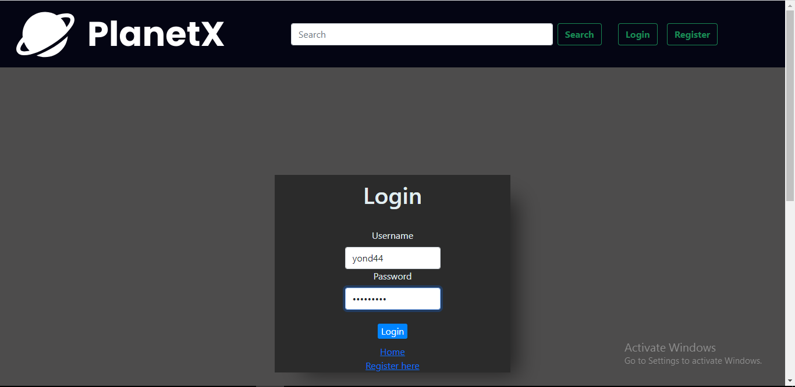

# **NOTE**

In this mini project I did more than what was asked. I used this mini project as my oppurtunity to explore and learned  more about front-end and React, that's why I would be very happy to get some advice, pointers and critics from mas Ihsan for my mini project whether it works well or not on LMS comment section or even on Whatsapp. And I'm really so sorry for my poor ability to make a markdown dokumentaion. 

# **USED SERVER(Back-end)**

* PlanetX back-end(my own back-end)

# **USED DATABASE**

*MySQL

# **USED MODULES in THE BACK-END**

* sequelize
* mysql2
* dotenv
* express
* jsonwebtoken
* cookie-parser

# **USED LIBRARIES in THE FRONT-END**

* axios
* react
* react-router-dom
* react-bootstrap
* react-loading
* js-cookie
* jwt-decode
* sweetalert

# **FEATURE LIST**

### **Note:  register, home and login can only be accesed if you logout. and in vice versa for dashboard,products, profile, change password can only be accesed if you login. the only page that can be accesed whenever you want is detail product page.**

## **Register**

in this section, merchants can register to get their account and every person must have unique username to be able to finish the process. if the username already used, there will be a notice that the username was already used. if the password empty, the notice will return "password can't be empty" and if other form emty, it will return "please fills all required form. 

## **Home**

This is where costumers and merchants can see all the products.
## **Login**

this is where merchants can login. 

## **Dasboard**

This is the dashboard page. as you can see, every merchant have their own dashboard page.

## **Detail Product**

This is where customers and merchants can see the detail of all products by clicking the product in home page or dashboard page.

## **Detail Product**

This is where the merchants can add, update, delete one by one or even delete all of thier own products at once. and only specified and authorized merchant can only access their own products.

## **Profile**

in this page, the merchants can update their profile, change their password or even delete their account(data, and products will also be deleted).

## **Logout**

you can logout your account by clicking the logout button on the navbar. 